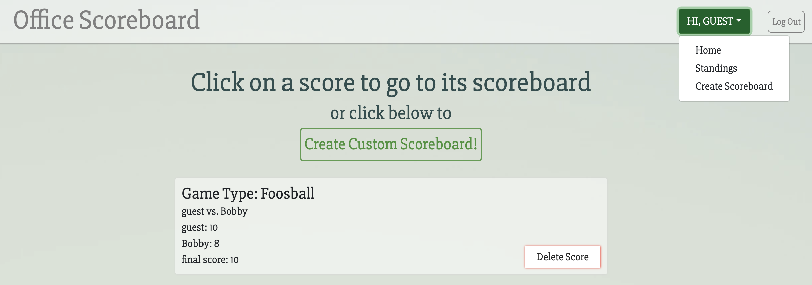
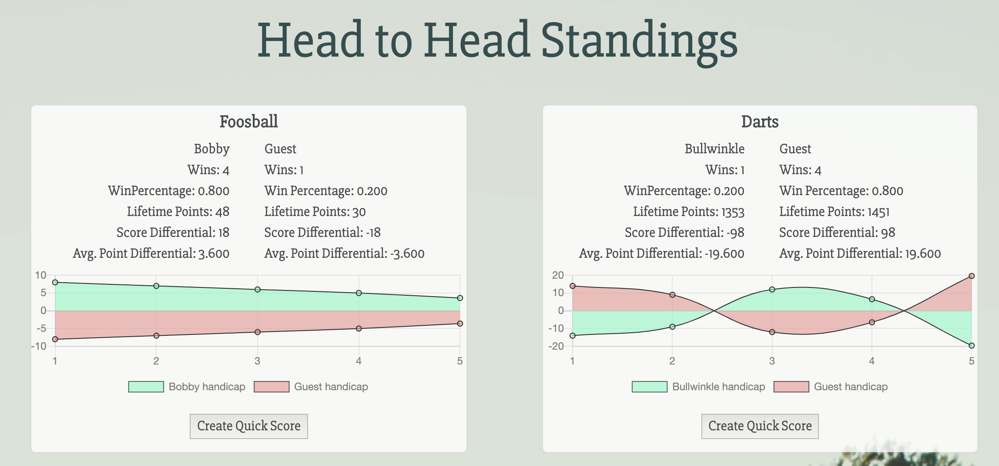
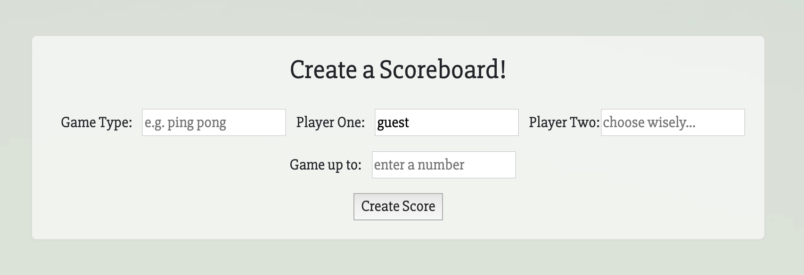

# Office Scoreboard



The Office Scoreboard is a full-stack web application that utilizes Ruby on Rails and PostgresSQL for its backend and React, Redux, and the Bootstrap library on the frontend. 

# What the Office Scoreboard does

This application was built to keep scores of your favorite office games. It tracks head to head matchups between you and your friends. Once games are completed they can be submitted to your autopopulated standings page that will display all the stats you could ever want. Lifetime wins, points, score differential, etc. are all stored in one convenient place so you can once and for all prove who's truly the best Ping Pong player in the office.  


## Authentication 

Password Encryption:

```ruby
def password=(password)
	@password = password
	self.password_digest = BCrypt::Password.create(password)
end
```

Users can create their own login with a username, email, and password (there is additionally an option to use the guest login to create quick scoreboards). The bcrypt gem is used to encrypt the password and every time a user logs in, a new session is created to keep the applications state. 


Checking proper password input:

```ruby 
def is_password?(password)
	BCrypt::Password.new(self.password_digest).is_password?(password)
end
```

## Standings



When a game is finished the user can submit the score to their local standings, the standings keep track of every game a player has participated in (even if they didn't create the scoreboard) and tracks data between specific game types and opponents. This was achieved by making SQL queries via Rails to sort all the game types and their respective players so no matter what order the players were entered into the scoreboard form, all the data would end up in the correct place without creating duplicate standings. 

Score Model Query: 

```ruby
def self.head_to_head_player_standings
	all.to_a.group_by(&:game_key).map do |game_key, scores|
		game_type, player_one, player_two = game_key.split("_")
		
		{
			game_type: game_type.split.map(&:capitalize).join(' '),
			player_one: player_one.capitalize,
			player_two: player_two.capitalize,
			stats: {
				total_games: scores.length,
				player_one_wins: scores.select { |score| score.winner.downcase == player_one }.length,
				player_two_wins: scores.select { |score| score.winner.downcase == player_two }.length,
			},
			scores: {
				player_one_total_points: scores.map { |score| score.player_one.downcase == player_one ? score.player_one_score : score.player_two_score }.reduce(:+),
				player_two_total_points: scores.map { |score| score.player_two.downcase == player_two ? score.player_two_score : score.player_one_score }.reduce(:+),
				player_one_points_collection: scores.map { |score| score.player_one.downcase == player_one ? score.player_one_score : score.player_two_score },
				player_two_points_collection: scores.map { |score| score.player_two.downcase == player_two ? score.player_two_score : score.player_one_score }
			},
			date: scores
		}
	end
end

def players_key
	[player_one, player_two].map(&:downcase).sort().join("_")
end

def game_key
	[game_type, players_key].map(&:downcase).join("_")
end
```

Utilizing React the statistics were easily derivable from the applications state by mapping the state to props through the standings reducer. 
There is also a create quick score button which will create a new scoreboard based on the opponents names, game type, and initial final score entered for the standing in which the button is clicked. Upon submission the data is appended to the form and then the user is redirected to the home page where they can click on the score and begin their new, self-populated game.

Standings React Component:

```JSX
navigateToScoreboard() {
	this.props.history.push('/');
}

handleSubmit(e) {
	e.preventDefault();
	const formData = new FormData();
	formData.append('score[game_type]', this.props.standing.game_type);
	formData.append('score[player_one]', this.props.standing.player_one);
	formData.append('score[player_two]', this.props.standing.player_two);
	formData.append('score[final_score]', this.props.standing.date[0].final_score);
	this.props.createScore(formData).then(() => (
		this.navigateToScoreboard()))
};

update(property) {
	return e => this.setState({
		[property]: e.target.value
	});
}

render() {
	const { game_type, player_one, player_two, stats, scores, date } = this.props.standing;

	return (
		<div className="standing-item-list">
			<li>
				<div className="whole-standings">
					<h4>{game_type}</h4>
					<div className="all-player-stats">
						<div className="player-game-stats">
							<span>{player_one}</span>
							<br />
							<span>Wins: {stats.player_one_wins}</span>
							<br/>
							<span>WinPercentage: {(stats.player_one_wins / stats.total_games).toFixed(3)}</span>
							<br />
							<span>Lifetime Points: {scores.player_one_total_points}</span>
							<br />
							<span>Score Differential: {scores.player_one_total_points - scores.player_two_total_points}</span>
							<br />
							<p>Avg. Point Differential: {((scores.player_one_total_points - scores.player_two_total_points) / stats.total_games).toFixed(3) }</p>
						</div>
						<hr />
						<div className="player-game-stats">
							<span>{player_two}</span>
							<br />
							<span>Wins: {stats.player_two_wins}</span>
							<br />					
							<span>Win Percentage: {(stats.player_two_wins / stats.total_games).toFixed(3) }</span>
							<br />					
							<span>Lifetime Points: {scores.player_two_total_points}</span>
							<br />
							<span>Score Differential: {scores.player_two_total_points - scores.player_one_total_points}</span>
							<br />
							<p>Avg. Point Differential: {((scores.player_two_total_points - scores.player_one_total_points) / stats.total_games).toFixed(3) }</p>
						</div>
					</div>
					<Chart 
						player_one={player_one}
						player_two={player_two}
						scores={scores}
						date={date}
						stats={stats}
						/>
					<form onSubmit={this.handleSubmit}>
						<div className="button-holder">
	            <input
	              type="submit"
	              value="Create Quick Score"
	              className="quick-score-button"
	            />
	          </div>
					</form>
				</div>
			</li>
		</div>
	)
}
```

The charts displayed on the standings page were created by using react-chartjs-2, a React wrapper for chart.js 2.

## Creating a New Scoreboard



To create a scoreboard the user just has to input the values for the gametype, their opponents name, and the score to which the game will be played. The player one value is automatically filled in and cannot be changed. When entering the opponents name, the user has the option to search for and select another user in the database or create a random username of their own choosing. 

## Future Features

There are many features that I would like to ultimately implement in the office scoreboard and I strongly believe there is a ton of potential yet to be explored! Below there are listed some features that I would like to tackle next. 

- A dropdown menu when creating a scoreboard that will create a scoreboard for a specific game type, especially when the scoring system can be inordinary (e.g. Tennis)
- Give users the option to create tournaments
- Team events and options for larger multiplayer games
- Add a social aspect where users can comment on past games or standings
- And many, many more!

